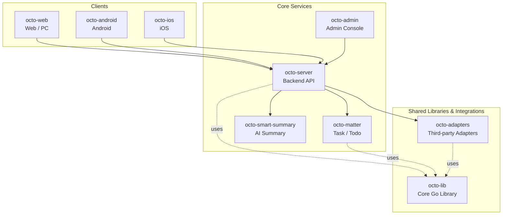

<p align="center">
  
  
</p>

<p align="center">
  <b>OCTO — the open workplace built for humans × AI agents.</b><br/>
  <sub>Let <b>Lobsters</b> (OpenClaw-powered digital doubles) do the <i>thinking</i> and <i>doing</i>. You focus on <i>taste</i>.</sub>
</p>

<p align="center">
  <a href="https://github.com/Mininglamp-OSS"><b>🏠 OCTO Home</b></a> ·
  <a href="#-quickstart"><b>🚀 Quickstart</b></a> ·
  <a href="#-octo-ecosystem"><b>📦 Ecosystem</b></a> ·
  <a href="./CONTRIBUTING.md"><b>🤝 Contributing</b></a>
</p>

<p align="center">
  <a href="./LICENSE"></a>
  <a href="./README.zh.md"></a>
</p>

---

> 🌐 **Read in**: **English** · [简体中文](README.zh.md)

# OCTO Smart-Summary

> **LLM-powered conversation summarisation** — turn long OCTO threads, group chats, and meeting transcripts into scannable briefs.

`octo-smart-summary` is a small Go service that wraps an OpenAI-compatible
LLM endpoint behind a narrow, OCTO-aware API. Given a conversation id
(`octo-server` channel / thread / meeting), it produces a structured summary
with key decisions, unanswered questions, and follow-up candidates — ready
to hand off to `octo-matter` as draft todos.

## 🌟 Why OCTO Smart-Summary

- **Narrow service, clean contract.** Only four endpoints (`/summarise`, `/summarise/stream`, `/healthz`, `/metrics`). No user state, no side effects beyond LLM calls and per-request tracing — easy to operate, easy to swap.
- **Bring your own LLM.** The LLM URL is a configurable `LLM_API_URL`; point it at any OpenAI-compatible endpoint (self-hosted vLLM / Ollama / Claude gateway / commercial API). No vendor lock-in.
- **Structured output, not prose dump.** Results are strict JSON (highlights, decisions, open questions, candidate actions) so downstream consumers — `octo-web`, `octo-matter`, Lobster agents — can render them natively instead of re-parsing free text.

## 🚀 Quickstart

```bash
git clone https://github.com/Mininglamp-OSS/octo-smart-summary.git
cd octo-smart-summary
go build ./cmd

# minimal config via env
export LLM_API_URL=https://api.example.com/v1
export LLM_API_KEY=sk-your-key-here
export MESSAGE_FETCH_BACKEND=batch
export OCTO_SEARCH_URL=http://octo-search-batch:8080
export OCTO_SEARCH_TOKEN=your-s2s-token
export OCTO_SEARCH_POLL_INTERVAL_SECONDS=1
export SUMMARY_LISTEN_ADDR=:8090
export TZ=Asia/Shanghai  # optional; app timezone, defaults to Asia/Shanghai

./cmd serve
```

`OCTO_SEARCH_URL` is the octo-search-batch base URL; do not include the `/v1`
suffix because the client appends the API path. Set `MESSAGE_FETCH_BACKEND=mysql`
to use the legacy MySQL message-content path.

Then, from another terminal:

```bash
curl -X POST http://localhost:8090/summarise \
  -H 'Content-Type: application/json' \
  -d '{"conversation_id": "channel:demo", "style": "brief"}'
```

## 📦 Modules / Architecture

Top-level packages:

| Path | Purpose |
|---|---|
| `cmd/` | Service entrypoint + subcommands |
| `internal/config/` | Env-driven config (LLM endpoint, rate limits, listen address) |
| `internal/handler/` | HTTP handlers — `/summarise`, `/summarise/stream`, `/healthz`, `/metrics` |
| `internal/service/` | Summarisation pipeline (fetch transcript → chunk → prompt → parse → enrich) |
| `internal/llm/` | LLM client — OpenAI-compatible `/v1/chat/completions` + streaming |
| `internal/octo/` | Thin client for `octo-server` — fetches the conversation transcript behind a scoped token |
| `internal/middleware/` | Auth, rate-limit, logging, tracing |
| `internal/model/` | Request / response structs (`SummaryRequest`, `SummaryResult`) |

Summary pipeline per request:

1. **Resolve** the conversation id against `octo-server` (scoped to the requesting operator).
2. **Chunk** the transcript into LLM-sized windows; preserve speaker / time boundaries.
3. **Prompt** the LLM with a summariser template (brief / standard / decision-log modes).
4. **Parse** the structured output; reject and re-prompt once if JSON validation fails.
5. **Enrich** with conversation metadata (participants, duration) and return.

## 🔗 OCTO Ecosystem

<!-- shared snippet: OCTO repo matrix. Keep identical across all 9 repos. -->



| Repository | Language | Role |
|---|---|---|
| [`octo-server`](https://github.com/Mininglamp-OSS/octo-server) | Go | Backend API · business orchestration · Lobster agent scheduling |
| [`octo-matter`](https://github.com/Mininglamp-OSS/octo-matter) | Go | Task / Todo / Matter micro-service |
| [`octo-smart-summary`](https://github.com/Mininglamp-OSS/octo-smart-summary) | Go | LLM-powered conversation summarisation |
| [`octo-web`](https://github.com/Mininglamp-OSS/octo-web) | TypeScript / React | Web & PC (Electron) client |
| [`octo-android`](https://github.com/Mininglamp-OSS/octo-android) | Kotlin / Java | Native Android client |
| [`octo-ios`](https://github.com/Mininglamp-OSS/octo-ios) | Swift / Objective-C | Native iOS client |
| [`octo-admin`](https://github.com/Mininglamp-OSS/octo-admin) | TypeScript / React | Admin console (tenant / org / user / channel management) |
| [`octo-lib`](https://github.com/Mininglamp-OSS/octo-lib) | Go | Shared core library (protocol, crypto, storage, HTTP) |
| [`octo-adapters`](https://github.com/Mininglamp-OSS/octo-adapters) | TypeScript / Python | Third-party integrations (IM bridges, AI channels) |

## 🧭 Philosophy

OCTO ships under three shared principles that apply to every repository in this matrix:

1. **Local-first.** Anything that can run on the user's own box — chats, embeddings, agents — should. Your data stays yours; cloud is a choice, not a requirement.
2. **Humans judge, AI thinks and acts.** Humans focus on *taste* (what matters, what's right, what to ship). Lobster agents — OpenClaw-powered digital doubles — carry the *thinking* and *execution* load.
3. **Release-as-product.** Every open-source cut is shipped as a self-contained product, not a code dump: one squash per release, Apache 2.0, no internal baggage, reproducible from this repo alone.

## 🤝 Contributing

We love pull requests! Before you open one, please read:

- [CONTRIBUTING.md](CONTRIBUTING.md) — workflow, branch model, commit style
- [CODE_OF_CONDUCT.md](CODE_OF_CONDUCT.md) — community expectations

For security issues please follow [SECURITY.md](SECURITY.md) instead of the public tracker.

## 📄 License

Apache License 2.0 — see [LICENSE](LICENSE) for the full text and [NOTICE](NOTICE) for third-party attributions.

---

<p align="center">
  <sub>Made with 🐙 by <b>OCTO Contributors</b> · <a href="https://github.com/Mininglamp-OSS">Mininglamp-OSS</a></sub>
</p>
