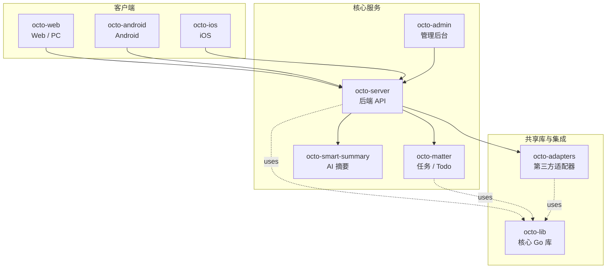

<p align="center">
  
  
</p>

<p align="center">
  <b>OCTO —— 为人和 AI Agent 协作而生的开源工作平台。</b><br/>
  <sub>让 <b>龙虾（Lobster / OpenClaw-powered digital double agents）</b>去「思」和「行」，让人专注于「品」。</sub>
</p>

<p align="center">
  <a href="https://github.com/Mininglamp-OSS"><b>🏠 OCTO 主页</b></a> ·
  <a href="#-快速开始"><b>🚀 快速开始</b></a> ·
  <a href="#-octo-生态"><b>📦 生态</b></a> ·
  <a href="./CONTRIBUTING.zh.md"><b>🤝 贡献</b></a>
</p>

<p align="center">
  <a href="./LICENSE"></a>
  <a href="./README.md"></a>
</p>

---

> 🌐 **语言**: [English](README.md) · **简体中文**

# OCTO Smart-Summary（简体中文）

> **基于 LLM 的会话摘要服务** —— 把长 OCTO 会话、群聊、会议记录压缩成可快速浏览的结构化摘要。

`octo-smart-summary` 是一个小型 Go 服务，把 OpenAI 兼容的 LLM 端点封装成一个
面向 OCTO 的窄 API。给它一个 conversation id（`octo-server` 频道 / 会话线程 /
会议），它产出一份结构化摘要 —— 关键决策、未决问题、候选后续动作 —— 可以直接
交给 `octo-matter` 作为草稿 todo。

## 🌟 为什么选 OCTO Smart-Summary

- **窄服务，干净契约。** 仅四个端点（`/summarise`、`/summarise/stream`、`/healthz`、`/metrics`）。没有用户状态，也没有除 LLM 调用和每请求链路追踪之外的副作用 —— 易运维、易替换。
- **自选 LLM。** LLM URL 由 `LLM_API_URL` 配置，可指向任意 OpenAI 兼容端点（自建 vLLM / Ollama / Claude 网关 / 商业 API）。不锁定厂商。
- **结构化输出，不是散文倾倒。** 结果是严格 JSON（highlights、decisions、open questions、candidate actions），下游（`octo-web` / `octo-matter` / 龙虾 Agent）可直接原生渲染，而不必再去解析自由文本。

## 🚀 快速开始

```bash
git clone https://github.com/Mininglamp-OSS/octo-smart-summary.git
cd octo-smart-summary
go build ./cmd

# 最小配置（环境变量）
export LLM_API_URL=https://api.example.com/v1
export LLM_API_KEY=sk-your-key-here
export SUMMARY_LISTEN_ADDR=:8090

./cmd serve
```

然后在另一个终端：

```bash
curl -X POST http://localhost:8090/summarise \
  -H 'Content-Type: application/json' \
  -d '{"conversation_id": "channel:demo", "style": "brief"}'
```

## 📦 模块与架构

顶层包：

| 路径 | 作用 |
|---|---|
| `cmd/` | 服务入口与子命令 |
| `internal/config/` | 基于环境变量的配置（LLM endpoint、限流、监听地址） |
| `internal/handler/` | HTTP handler —— `/summarise`、`/summarise/stream`、`/healthz`、`/metrics` |
| `internal/service/` | 摘要流水线（取转录 → 分块 → 提示 → 解析 → 丰富） |
| `internal/llm/` | LLM 客户端 —— OpenAI 兼容的 `/v1/chat/completions` 与流式 |
| `internal/octo/` | 面向 `octo-server` 的薄客户端，用带作用域的 token 取会话转录 |
| `internal/middleware/` | 认证 / 限流 / 日志 / 追踪 |
| `internal/model/` | 请求 / 响应结构（`SummaryRequest`、`SummaryResult`） |

每次请求的摘要流水线：

1. **Resolve（解析）** 在 `octo-server` 里解析 conversation id（按请求方运营者的作用域）。
2. **Chunk（分块）** 把转录切分为 LLM 能吃下的窗口；保留讲者 / 时间边界。
3. **Prompt（提示）** 使用摘要模板（brief / standard / decision-log 三种模式）调 LLM。
4. **Parse（解析）** 解析结构化输出；若 JSON 校验失败则重试一次提示。
5. **Enrich（丰富）** 补齐会话元数据（参与者、时长）后返回。

## 🔗 OCTO 生态

<!-- 共享片段：OCTO 仓库矩阵。9 个仓库之间保持一致。 -->



| 仓库 | 语言 | 职责 |
|---|---|---|
| [`octo-server`](https://github.com/Mininglamp-OSS/octo-server) | Go | 后端 API · 业务编排 · 龙虾 Agent 调度 |
| [`octo-matter`](https://github.com/Mininglamp-OSS/octo-matter) | Go | 任务 / Todo / Matter 微服务 |
| [`octo-smart-summary`](https://github.com/Mininglamp-OSS/octo-smart-summary) | Go | 基于 LLM 的会话摘要服务 |
| [`octo-web`](https://github.com/Mininglamp-OSS/octo-web) | TypeScript / React | Web 与 PC（Electron）客户端 |
| [`octo-android`](https://github.com/Mininglamp-OSS/octo-android) | Kotlin / Java | 原生 Android 客户端 |
| [`octo-ios`](https://github.com/Mininglamp-OSS/octo-ios) | Swift / Objective-C | 原生 iOS 客户端 |
| [`octo-admin`](https://github.com/Mininglamp-OSS/octo-admin) | TypeScript / React | 管理后台（租户 / 组织 / 用户 / 频道管理） |
| [`octo-lib`](https://github.com/Mininglamp-OSS/octo-lib) | Go | 共享核心库（协议 / 加密 / 存储 / HTTP） |
| [`octo-adapters`](https://github.com/Mininglamp-OSS/octo-adapters) | TypeScript / Python | 第三方集成（IM 桥接、AI 渠道） |

## 🧭 设计哲学

OCTO 遵循三条共用原则 —— 这套矩阵里的每个仓都一致：

1. **本地优先（Local-first）。** 能跑在用户本机的一切（对话、向量、智能体）都应尽量在本机完成。你的数据属于你；云是可选项，不是前置条件。
2. **人做「品」，AI 做「思」与「行」。** 人聚焦在品味（什么重要、什么对、该发什么）。龙虾（OpenClaw 驱动的数字分身）承担思考与执行。
3. **Release-as-product（每次发布即产品）。** 每一次开源切片都是一个自洽的产品，不是代码倾倒：一个 release 一次 squash，Apache 2.0，不夹带内部包袱，单仓即可复现。

## 🤝 贡献

欢迎提 Pull Request！开 PR 前请先读：

- [CONTRIBUTING.zh.md](CONTRIBUTING.zh.md) —— 工作流、分支模型、commit 规范
- [CODE_OF_CONDUCT.zh.md](CODE_OF_CONDUCT.zh.md) —— 社区行为准则

安全问题请按 [SECURITY.zh.md](SECURITY.zh.md) 上报，不要走公开 issue。

## 📄 许可

Apache License 2.0 —— 完整文本见 [LICENSE](LICENSE)，第三方致谢见 [NOTICE](NOTICE)。

---

<p align="center">
  <sub>由 <b>OCTO Contributors</b> 🐙 共同开发 · <a href="https://github.com/Mininglamp-OSS">Mininglamp-OSS</a></sub>
</p>
